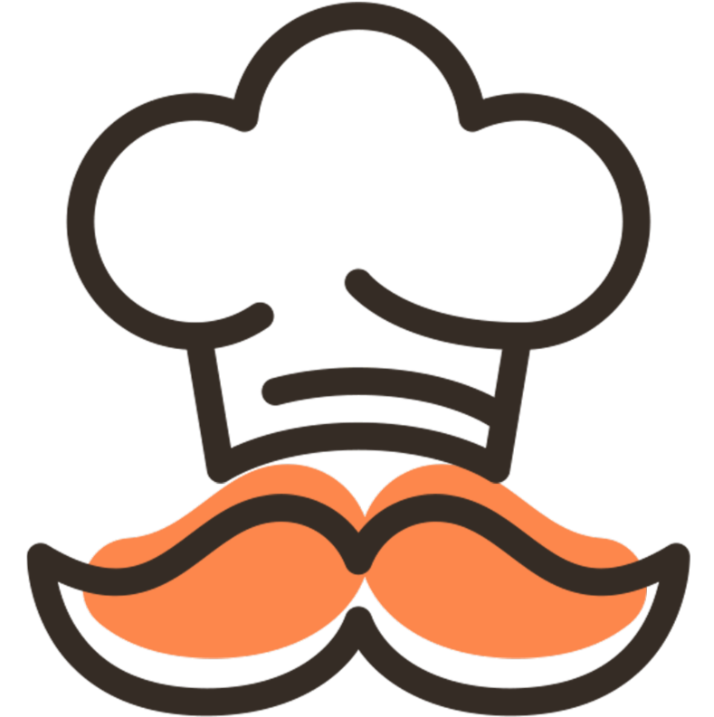
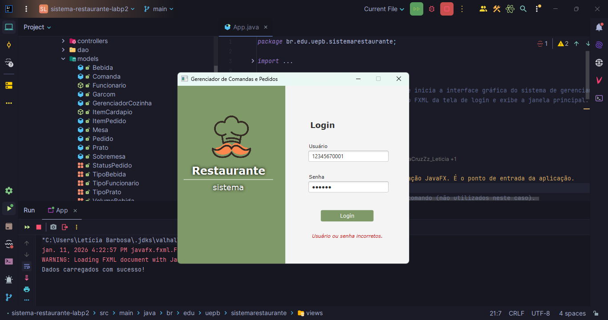
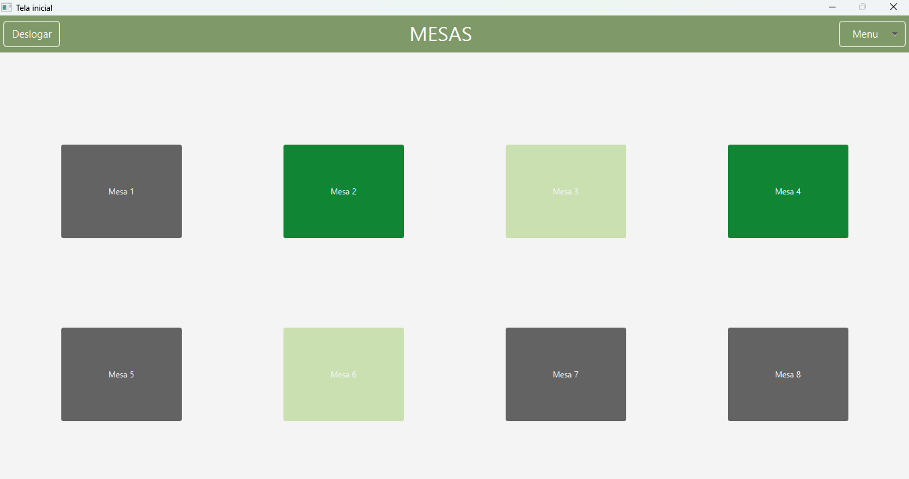
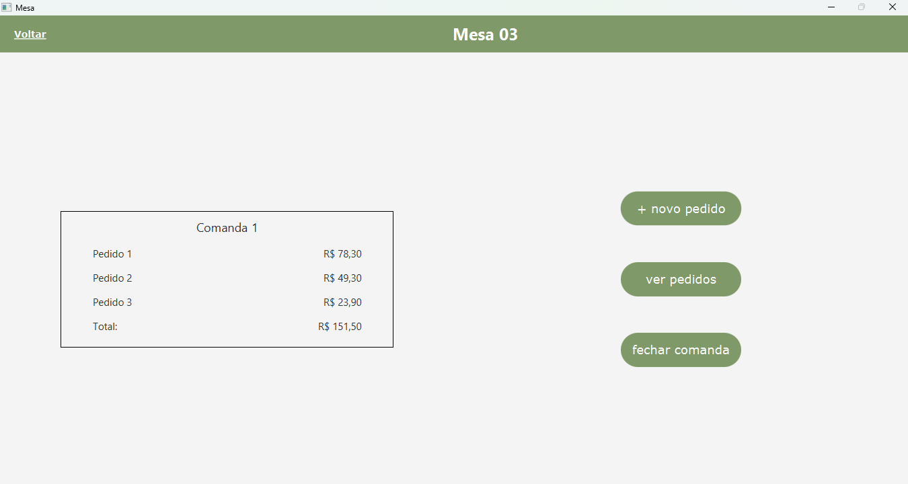
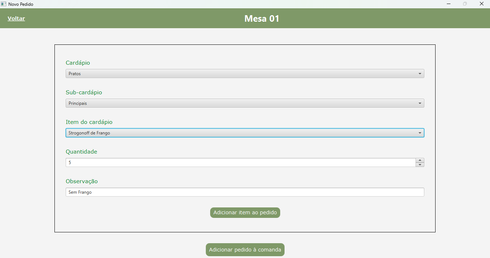

<a id="readme-topo"></a>

<div align="center">

</div>

<h1 align="center"> 
	Sistema Restaurante - Comandas & Pedidos
</h1>

  <p align="center">
    Projeto acadêmico com foco em aplicar, de forma integrada, os principais conceitos de <strong>Programação Orientada a Objetos</strong> (POO), em <strong>Java</strong>, estudados ao longo da disciplina de <b>Linguagem de Programação II (LP2)</b>, desde a <i>modelagem UML das Classes</i> até <i>testes</i> automatizados simples.
    <br>
    <a href="https://leticia-academico-uepb.github.io/sistema-restaurante-labp2/br.edu.uepb.sistemarestaurante/module-summary.html"><strong>Documentação Técnica (Java Doc.) »</strong></a>
  </p>

<br/>

> ✅ Status do Projeto: Finalizado

<details>
  <summary>Índice de Conteúdo (clicar para ver)</summary>
  <ol>
    <li>
      <a href="#sobre-o-projeto">Sobre o Projeto</a>
      <ul>
        <li><a href="#funcionalidades">Funcionalidades</a></li>
      </ul>
    </li>
    <li>
      <a href="#imagens-do-sistema">Imagens do Sistema</a>
    </li>
    <li><a href="#requisitos-de-entrega">Requisitos de Entrega</a></li>
    <li><a href="#diagrama-de-classes">Diagrama de Classes</a></li>
<li><a href="#tecnologias-e-ferramentas">Tecnologias e Ferramentas</a></li>
    <li><a href="#organizacao-do-projeto">Organização do Projeto</a></li>
<li><a href="#integrantes-da-equipe">Integrantes da Equipe</a></li>
  </ol>
</details>

<h2 id="sobre-o-projeto">Sobre o Projeto</h2>

Sistema para Restaurante que ajuda garçons e cozinheiros no controle de comandas e pedidos:

-   Registra e organiza os pedidos feitos nas mesas. Seu principal objetivo é facilitar o controle dos pedidos, associando-os a mesas, garçons e itens do cardápio, além de acompanhar o status de preparo dos pratos.

-   Auxilia no fechamento da conta e no controle da ocupação das mesas, evitando erros manuais e melhorando a eficiência do atendimento.

<br>

> [!NOTE]
> Cada Grupo deveria escolher livremente sua temática para o sistema Java a ser desenvolvido.

### Funcionalidades

-   Login para funcionários garçom e gerenciador da cozinha.

 <b>Para garçom:</b>

-   Menu principal com as mesas (clicáveis) do restaurante, botão para deslogar e botão de notificação;
-   Tela de comanda associada a mesa selecionada, contém pedidos feitos e o valor total da comanda, botão de novo pedido, de ver pedidos e de encerrar comanda;
-   Menu seleção dos itens do cardápio, organizados por `PRATO`, `SOBREMESA` e `BEBIDA`, para um novo pedido. Cada item tem opção de adicionar, se necessário, uma observação conforme específicado pelo cliente;
-   Tela de notificações listando todos os pedidos que estão na cozinha prontos (status = `PROTNO`) para serem entregues às mesas.

 <b>Para gerenciador da cozinha:</b>

-   Lista de pedidos para funcionário gerenciador da cozinha, filtrados pelo status `PENDENTE` e `PREPARANDO`. Pedidos deixam de ser apresentados quando marcados como `PRONTO`.

<p align="right">(<a href="#readme-topo">voltar para o topo</a>)</p>

<h2 id="imagens-do-sistema">Imagens do Sistema</h2>

A seguir, algumas imagens das telas desenvolvidas com Scene Builder e JavaFX para o sistema:

<b>Tela | Login (Funcionários)</b>


> Tenta de login (campos com dados incorretos).

<br>

<b>Tela | Painel de Mesas</b>


> Mesas livres (cinza), mesas atendidas pelo garçom logado (verde-escuro) e mesas atendidas por outro garçom (verde-claro).

<br>

<b>Tela | Pedidos de uma Mesa</b>


> Mostra valores de cada pedido na mesa selecionada e valor total, botões de novo pedido, ver pedidos (mostra os itens pedidos) e encerrar comanda (liberar mesa/encerrar atendimento).

<br>

<b>Tela | Fazendo um Novo Pedido</b>


> Selecionar tipo do Cardápio (prato, bebida ou sobremesa), Sub-cardápio (refrigerante » bebida, entrada » prato e etc. ), item específico, quantidade (min. 1 unidade)e observação (opcional). Vários itens podem fazer parte de um pedido, vários pedido podem fazer parte da comanda da mesa.

<br>

<b>Tela | Lista de Pedidos Visto pela Cozinha</b>


> Tela de Ver Pedidos _em uma mesa_ é semelhante à Tela dos Pedidos _visto pela cozinha_. Difere que cada mesa lista seus pedidos, enquando cozinha mostra de todas as mesas e altera status (botão).

<p align="right">(<a href="#readme-topo">voltar para o topo</a>)</p>

<h2 id="requisitos-de-entrega"> Requisitos de Entrega</h2>

<details>
  <summary> <b>✅ Diagrama de classes (UML) </b> (ver mais)</summary>

> Criar um diagrama com as classes do sistema, incluindo atributos (com tipos e visibilidades), métodos (com assinaturas de parâmetros e tipos de retorno) e os relacionamentos entre elas (associação, agregação, composição, herança), com as devidas multiplicidades.

</details>

<details>
  <summary> <b> ✅ Classes e Objetos</b> (ver mais)</summary>

> Definir atributos e métodos que representem as características e comportamentos do domínio escolhido. Implementar construtores padrão e parametrizados.

</details>

<details>
  <summary> <b> ✅ Encapsulamento</b> (ver mais)</summary>

> Aplicar modificadores de acesso (private, public, protected, default). Incluir getters e setters (podem ser omitidos no diagrama UML). Sobrescrever toString() para fornecer uma representação legível dos objetos.

</details>

<details>
  <summary> <b> ✅ Membros estáticos</b> (ver mais)</summary>

> Utilizar pelo menos um atributo static (por exemplo, um contador de instâncias). Criar pelo menos um método static utilitário (por exemplo, conversão de unidades ou cálculos auxiliares).

</details>

<details>
  <summary> <b> ✅ Relacionamentos, Coleções e Enumerações</b> (ver mais)</summary>

> Modelar os relacionamentos entre objetos (um-para-um, um-para-muitos, muitos-para-muitos), utilizando adequadamente agregação e composição. Utilizar ArrayList ou outras coleções da API Java para armazenar conjuntos de objetos. Utilizar enum para representar conjuntos fixos de constantes, como categorias, níveis, tipos, status, etc.

</details>

<details>
  <summary> <b> ✅ Herança e Polimorfismo</b> (ver mais)</summary>

> Implementar herança por meio de subclasses especializadas. Aplicar polimorfismo em chamadas de métodos e utilizar sobrecarga quando apropriado.

</details>

<details>
  <summary> <b> ✅ Classes Abstratas e Interfaces</b> (ver mais)</summary>

> Incluir pelo menos uma classe abstrata e/ou uma interface para definir comportamentos genéricos com múltiplas implementações.

</details>

<details>
  <summary> <b> ✅ Tratamento de Exceções</b> (ver mais)</summary>

> Implementar try-catch (e finally, se necessário) para lidar com possíveis erros de execução esperados (entrada/saída, validações, etc.).

</details>

<details>
  <summary> <b> ✅ Testes de Unidade</b> (ver mais)</summary>

> Criar testes básicos com JUnit para validar os comportamentos principais das classes e as regras de negócio.

</details>

<details>
  <summary> <b> ✅ Documentação e Interface Gráfica</b> (ver mais)</summary>

> Documentar o código com JavaDoc, utilizando as tags adequadas (@param, @return, @throws, etc.). Criar uma interface gráfica (GUI) simples para o sistema/jogo, mesmo que com recursos básicos.

</details>

<p align="right">(<a href="#readme-topo">voltar para o topo</a>)</p>

<h2 id="diagrama-de-classes">Diagrama de Classes</h2>

<a href="docs/images/diagrama-de-classes-drawio.svg" target="_blank">

</a>

> clique na imagem para ampliar

<p align="right">(<a href="#readme-topo">voltar para o topo</a>)</p>

<h2 id="tecnologias-e-ferramentas">Tecnologias e Ferramentas</h2>

### Tecnologias

-   **Java v21 (LTS)** – linguagem utilizada no desenvolvimento da aplicação.
-   **JavaFX v21** – framework para criação da interface gráfica.
-   **JUnit v5.10.2** – framework para testes unitários.

### Ferramentas

-   **Maven** – gerenciamento de dependências e build do projeto.
-   **IntelliJ IDEA Community v21.0.6** – ambiente de desenvolvimento (IDE).
-   **Scene Builder** – ferramenta visual para criação de interfaces JavaFX.
-   **Draw.io** – criação de diagramas e documentação.

<p align="right">(<a href="#readme-topo">voltar para o topo</a>)</p>

<h2 id="organizacao-do-projeto">Organização do Projeto</h2>

O projeto segue a arquitetura **MVC (Model–View–Controller)** para garantir a separação de responsabilidades e manter organização do código durante o desenvolvimento do sistema.

```
sistema-resturante-labp2
├───.idea
├───.mvn
│   └───wrapper
├───docs-readme
│   └───images
├───src
│   ├───main
│   │   ├───java
│   │   │   └───br
│   │   │       └───edu
│   │   │           └───uepb
│   │   │               └───sistemarestaurante
│   │   │                   ├───controllers
│   │   │                   ├───dao
│   │   │                   ├───models
│   │   │                   ├───services
│   │   │                   ├───utils
│   │   │                   └───views
│   │   └───resources
│   │       └───br
│   │           └───edu
│   │               └───uepb
│   │                   └───sistemarestaurante
│   │                       └───images
│   └───test
│       └───java
│           └───br
│               └───edu
│                   └───uepb
│                       └───sistemarestaurante
│                           └───models
└───target
    ├───classes
    │   └───br
    │       └───edu
    │           └───uepb
    │               └───sistemarestaurante
    │                   ├───controllers
    │                   ├───dao
    │                   ├───images
    │                   ├───models
    │                   ├───services
    │                   ├───utils
    │                   └───views
    ├───generated-sources
    │   └───annotations
    └───test-classes
        └───br
            └───edu
                └───uepb
                    └───sistemarestaurante
                        └───models
```

-   **models** – contém as classes de domínio do sistema, responsáveis por representar os dados e as regras básicas da aplicação.
-   **views** – responsável pela camada de apresentação, contendo as interfaces gráficas desenvolvidas com JavaFX.
-   **controllers** – atua como intermediário entre a camada de visão e os modelos, tratando eventos da interface e controlando o fluxo da aplicação.
-   **dao** – camada de acesso a dados, responsável pela inserção de dados externos (dados de login, pratos, bebidas e sobremesas).
-   **services** – concentra a lógica de negócio, evitando que regras complexas fiquem acopladas aos controllers ou aos models.
-   **utils** – classes utilitárias e funcionalidades auxiliares reutilizáveis no projeto.

A estrutura do diretório `src/main/java` abriga o código-fonte principal da aplicação, enquanto `src/test/java` contém os testes unitários, organizados principalmente para a validação das classes de modelo. Os recursos visuais, como imagens, encontram-se em `src/main/resources`, mantendo a separação entre código e arquivos estáticos.

<p align="right">(<a href="#readme-topo">voltar para o topo</a>)</p>

<h2 id="integrantes-da-equipe"> Integrantes da Equipe</h2>

-   [Laryssa Dantas](https://github.com/laryssadrr)
-   [Letícia Cruz](https://github.com/daCruzZzLeticia)
-   [Marcella Viana](https://github.com/MarcellaLins)
-   [Ruan Miguel](https://github.com/RuanMiguel)

<p align="right">(<a href="#readme-topo">voltar para o topo</a>)</p>
